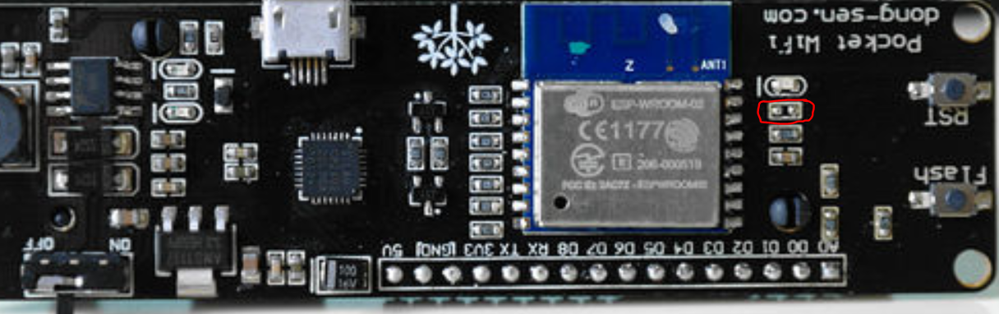

# BatteryPoweredEnvSensor
An ESP8266 with Battery and BME280 are used to measure and send values to a KNX bus

Steps for building your sensor:

1. Hardware modification
2. Create *WifiConfig.h* file
3. Compile
4. Upload

## Partlist

## Code
The Wifi credentials are stored in a separate file *WifiConfig.h* which needs to be created and placed in the same folder as the *BatteryPoweredEnvSensor.ino*.

It should contain two lines with your credentials:

```c
const char *ssid = "your_SSID";
const char *password = "your_PASSWORD";
```

### Arduino libraries
- Adafruit_Sensor
- Adafruit BME280 Library
- https://github.com/envy/esp-knx-ip
Install the library:
   
  In the folder **%userprofile%\documents\arduino\libraries** glone the repository with **git clone https://github.com/envy/esp-knx-ip.git**
    